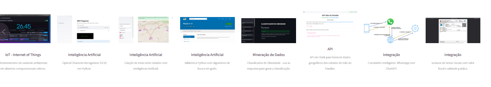

<h1 align="center">PORTFÓLIO</h1>

Olá, Nesse repositório está a criação e evolução do meu portfólio. Uma página Web onde exponho com mais detalhes (imagem e explicação) de alguns projetos que realizei; experiências e formação. Coloquei também informações da minha vida comum. Espero que através dele eu consiga me apresentar o suficiente :smile: .  

